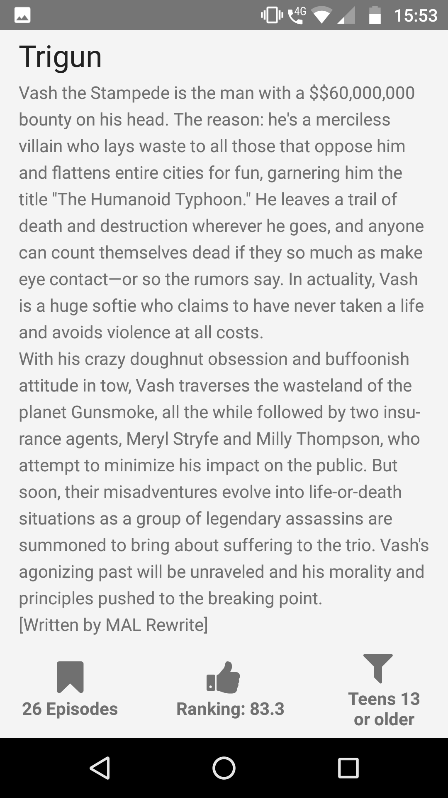

# Animes List

Animes List is amazing app made by Nativescript, it will helps you make your application that needs an infinite list of contents.

### Preview

[**see demonstration here**](https://play.nativescript.org/?template=play-tsc&id=w3pena&v=11)
### Nativescrit-Ui-Listview

[A Deep dive into Nativescript](https://www.nativescript.org/blog/a-deep-dive-into-telerik-ui-for-nativescripts-listview) is **excellent repo** which explains to you about it works. So hands-on 💪💪💪

You will find more here: [Radlist Documentation](https://docs.telerik.com/devtools/nativescript-ui/Controls/NativeScript/ListView/overview)

